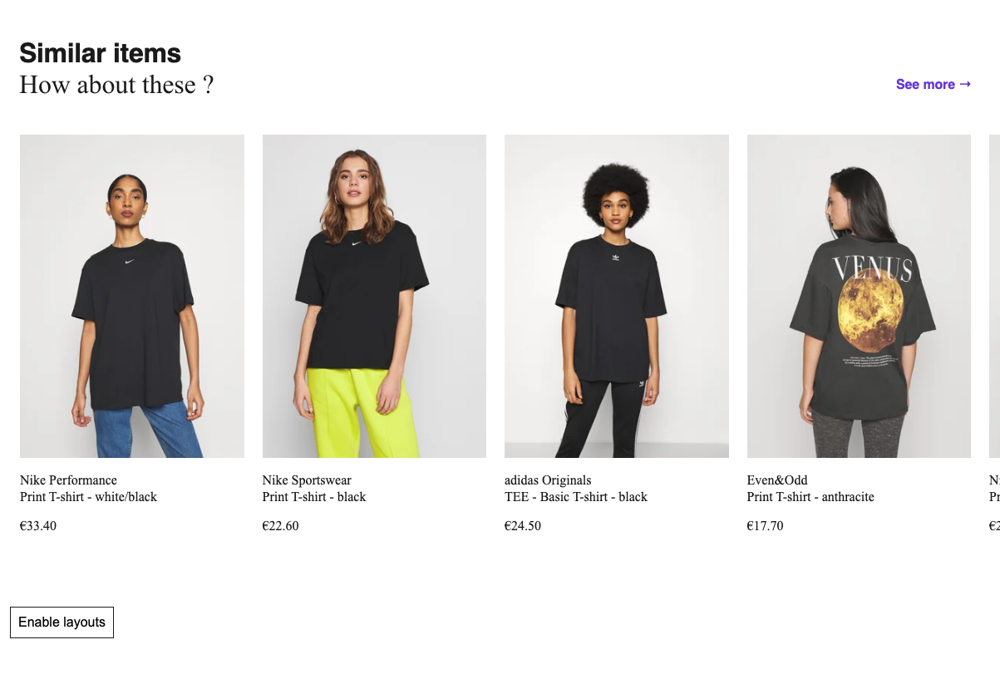

The purpose of this project is to study Frontend development of Zalando web application.

#### Core areas of study

- Identify the design patterns
- Identify frontend techniques may have been used
- Explore new ideas for delivering straigtforward user experience

## Screensots 
### Recommendation 

## Reference

Official Zalando website [Official Zalando](https://www.zalando.ie/women-home/)  
Zalando Design [Zalando design](https://medium.com/zalando-design)
